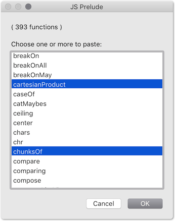

# prelude-jxa
Generic functions for:

- **macOS** scripting with JavaScript for Automation
- **iOS** scripting in JavaScript, with apps like the excellent [1Writer](http://1writerapp.com/), and @agiletortoise's Drafts.

## Details:

- Function names are as in [Hoogle](https://www.haskell.org/hoogle/?hoogle=concatMap).
- The 400+ functions in [jsPrelude.js](https://github.com/RobTrew/prelude-jxa/blob/master/jsPrelude.js) are generic and cross-platform (macOS, iOS etc),
- The 20+ functions in [jxaSystemIO.js](https://github.com/RobTrew/prelude-jxa/blob/master/jxaSystemIO.js) are specific to macOS.

For the purposes of sketching and testing  a script,  
the JavaScriptCore interpreter used on macOS and iOS is fast enough
to allow for import of the whole of the [jsPrelude.js](https://github.com/RobTrew/prelude-jxa/blob/master/jsPrelude.js) file and,
in the case of macOS, the [jxaSystemIO.js](https://github.com/RobTrew/prelude-jxa/blob/master/jxaSystemIO.js) file as well.

(c. 500 generic and file-system functions in total)

**Display a menu of functions to copy to the clipboard**

 

```javascript
(() => {
    'use strict';

    // Library files at:
    // https://github.com/RobTrew/prelude-jxa
    const jsonPath = '~/prelude-jxa/jsPreludeDict.json';

    // main :: IO ()
    const main = () =>
        bindLR(
            bindLR(
                doesFileExist(jsonPath) ? (
                    readFileLR(jsonPath)
                ) : Left(`File not found at path: '${fp}'`),
                jsonParseLR
            ),
            dctFns => {
                const
                    sa = standardSEAdditions(),
                    ks = Object.keys(dctFns),
                    choice = (
                        sa.activate(),
                        sa.chooseFromList(
                            ks, {
                                withTitle: 'JS Prelude',
                                withPrompt: `( ${ks.length} functions )` +
                                    '\n\nChoose one or more to paste:',
                                defaultItems: ks[0],
                                multipleSelectionsAllowed: true,
                                emptySelectionAllowed: true
                            }
                        )
                    );
                return choice ? (() => {
                    const
                        strFns = choice.map(k => dctFns[k])
                        .join('\n\n');
                    return (
                        sa.setTheClipboardTo(strFns),
                        Right(strFns)
                    );
                })() : Left('User cancelled.');
            }
        );

    // GENERIC FUNCTIONS --------------------------------------

    // Left :: a -> Either a b
    const Left = x => ({
        type: 'Either',
        Left: x
    });

    // Right :: b -> Either a b
    const Right = x => ({
        type: 'Either',
        Right: x
    });

    // bindLR (>>=) :: Either a -> (a -> Either b) -> Either b
    const bindLR = (m, mf) =>
        m.Right !== undefined ? (
            mf(m.Right)
        ) : m;

    // doesFileExist :: FilePath -> IO Bool
    const doesFileExist = strPath => {
        const ref = Ref();
        return $.NSFileManager.defaultManager
            .fileExistsAtPathIsDirectory(
                $(strPath)
                .stringByStandardizingPath, ref
            ) && ref[0] !== 1;
    };

    // jsonParseLR :: String -> Either String a
    const jsonParseLR = s => {
        try {
            return Right(JSON.parse(s));
        } catch (e) {
            return Left(`${e.message} (line:${e.line} col:${e.column})`);
        }
    };

    // readFileLR :: FilePath -> Either String String
    const readFileLR = strPath => {
        const
            error = $(),
            str = ObjC.unwrap(
                $.NSString.stringWithContentsOfFileEncodingError(
                    $(strPath)
                    .stringByStandardizingPath,
                    $.NSUTF8StringEncoding,
                    error
                )
            );
        return Boolean(error.code) ? (
            Left(error.message)
        ) : Right(str);
    };

    // JXA   ---

    // standardSEAdditions :: () -> Application
    const standardSEAdditions = () =>
        Object.assign(Application('System Events'), {
            includeStandardAdditions: true
        });

    // MAIN ---
    return main();
})();
```
