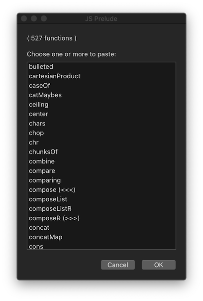

# prelude-jxa
Generic functions for:

- **macOS** scripting with JavaScript for Automation
- **iOS** scripting in JavaScript, with apps like the excellent [1Writer](http://1writerapp.com/), and @agiletortoise's Drafts.

## Details:

- Function names are as in [Hoogle](https://www.haskell.org/hoogle/?hoogle=concatMap).
- The 300+ functions in [jsPrelude.js](https://github.com/RobTrew/prelude-jxa/blob/master/jsPrelude.js) are generic and cross-platform (macOS, iOS etc),
- The 20+ functions in [jxaSystemIO.js](https://github.com/RobTrew/prelude-jxa/blob/master/jxaSystemIO.js) are specific to macOS.

For the purposes of sketching and testing  a script,  
the JavaScriptCore interpreter used on macOS and iOS is fast enough
to allow for import of the whole of the [jsPrelude.js](https://github.com/RobTrew/prelude-jxa/blob/master/jsPrelude.js) file and,
in the case of macOS, the [jxaSystemIO.js](https://github.com/RobTrew/prelude-jxa/blob/master/jxaSystemIO.js) file as well.

(c. 380 generic and file-system functions in total)

**Display a menu of functions to copy to the clipboard**

( Example of a JavaScript for Automation script which uses imported library
 file(s) – see the `usingLibs` function called at the end )

 

```javascript
(() => {
    'use strict';

    // Rob Trew (c) 2018 MIT

    // macOS menu for choosing a set of Prelude functions to paste.

    // Edit these file paths to match your system.
    const
        // Library files at:
        // https://github.com/RobTrew/prelude-jxa
        jsonPath = '~/prelude-jxa/jsPreludeDict.json',
        jsPreludeLibPath = '~/prelude-jxa/jsPrelude.js',
        jxaSystemLibPath = '~/prelude-jxa/jxaSystemIO.js';

    // main :: IO ()
    const main = () => {

        // standardSEAdditions :: () -> Application
        const standardSEAdditions = () =>
            Object.assign(Application('System Events'), {
                includeStandardAdditions: true
            });

        return bindLR(
            bindLR(
                doesFileExist(jsonPath) ? (
                    readFileLR(jsonPath)
                ) : Left(`File not found at path: '${fp}'`),
                jsonParseLR
            ),
            dctFns => {
                const
                    sa = standardSEAdditions(),
                    ks = Object.keys(dctFns),
                    choice = (
                        sa.activate(),
                        sa.chooseFromList(
                            ks, {
                                withTitle: 'JS Prelude',
                                withPrompt: `( ${ks.length} functions )` +
                                    '\n\nChoose one or more to paste:',
                                defaultItems: ks[0],
                                multipleSelectionsAllowed: true,
                                emptySelectionAllowed: true
                            }
                        )
                    );
                return choice ? (() => {
                    const
                        strFns = choice.map(k => dctFns[k])
                        .join('\n\n');
                    return (
                        sa.setTheClipboardTo(strFns),
                        strFns
                    );
                })() : '';
            }
        );
    };

    // LIBRARY IMPORT --------------------------------------

    // Evaluate a function f :: (() -> a)
    // in the context of the JS libraries whose source
    // filePaths are listed in fps :: [FilePath]

    // usingLibs :: [FilePath] -> (() -> a) -> a
    const usingLibs = (fps, f) =>
        fps.every(doesFileExist) ? (
            eval(`(() => {
                'use strict';
                ${fps.map(readFile).join('\n\n')}
                return (${f})();
            })();`)
        ) : 'Library not found at: ' + [].concat(...fps.map(
            fp => doesFileExist(fp) ? [] : [fp]
        )).join('\n');

    // doesFileExist :: FilePath -> IO Bool
    const doesFileExist = strPath => {
        const ref = Ref();
        return $.NSFileManager.defaultManager
            .fileExistsAtPathIsDirectory(
                $(strPath)
                .stringByStandardizingPath, ref
            ) && ref[0] !== 1;
    };

    // readFile :: FilePath -> IO String
    const readFile = strPath => {
        let error = $(),
            str = ObjC.unwrap(
                $.NSString.stringWithContentsOfFileEncodingError(
                    $(strPath)
                    .stringByStandardizingPath,
                    $.NSUTF8StringEncoding,
                    error
                )
            );
        return Boolean(error.code) ? (
            ObjC.unwrap(error.localizedDescription)
        ) : str;
    };

    // MAIN ------------------------------------------------
    return usingLibs(
        [
            jsPreludeLibPath,
            jxaSystemLibPath
            // '~/Library/Script Libraries/BBDrafts.js'
        ],
        main
    );
})();
```
